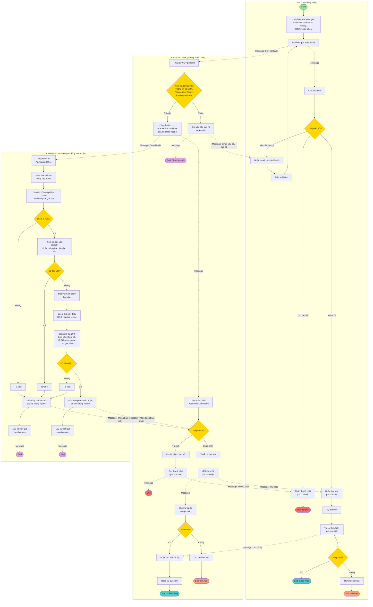

# BÀI TẬP BUỔI 4 - QUY TRÌNH CHI TIẾT XÉT TUYỂN HỌC VIÊN

**TRƯỜNG ĐẠI HỌC CÔNG NGHỆ THÔNG TIN**  
**KHOA: CÔNG NGHỆ THÔNG TIN**  
**MÔN HỌC: HỆ THỐNG QUẢN TRỊ QUY TRÌNH NGHIỆP VỤ**

**Lớp**: IE203.F11.LT.CNTT  
**GV**: ThS. Hà Lê Hoài Trung

---

**BÀI TẬP VỀ NHÀ - VẼ QUY TRÌNH CHI TIẾT**

***Thành viên nhóm:*** 

| STT | Họ & tên | MSSV |
| :---: | :---- | :---- |
| 1 | Nguyễn Văn Tình | 24410362 |
| 2 | Nguyễn Trung Đông | 24410284 |
| 3 | Nguyễn Hải Đông | 24410283 |
| 4 | Đinh Trường Phi | 24410334 |
| 5 | Lê Thanh Nguyên | 24410330 |

---

## 1. PHÂN TÍCH THÔNG TIN PHỎNG VẤN

### 1.1. Các bên liên quan

- **Applicant (Ứng viên)**: Người nộp đơn xét tuyển
- **Student Admission Officer (Cán bộ tuyển sinh)**: 
  - Mary Adams
  - Louise Smith
- **Academic Committee Member (Thành viên hội đồng học thuật)**: 
  - Peter Capello
- **Process Owner**: Mark Johnson (xác nhận Enrollment Office không tham gia quy trình này)

### 1.2. Tóm tắt quy trình từ phỏng vấn

#### Từ phỏng vấn Mary Adams:
- Nhận đơn xét tuyển
- Kiểm tra tính đầy đủ của đơn
- Nếu thiếu → Gửi yêu cầu làm rõ cho ứng viên
- Nếu đủ → Chuyển cho Academic Committee
- Nhận phản hồi từ Academic Committee:
  - **Thông báo chấp nhận**: Chuẩn bị thư mời, gửi qua bưu điện để lấy chữ ký. Thường nhận được thư đã ký, đôi khi không.
  - **Thông báo từ chối**: Gửi thư từ chối qua bưu điện thường

#### Từ phỏng vấn Louise Smith:
- Kiểm tra đơn có đầy đủ thông tin: tên, địa chỉ, số điện thoại, email
- Web portal có lỗi, đôi khi cho phép đơn không đầy đủ
- Khi đơn đầy đủ → Chuyển cho Academic Committee qua hệ thống nội bộ
- Nhận phản hồi:
  - **Thông báo chấp nhận**: Chuẩn bị thư mời, gửi qua bưu điện. Ứng viên phải trả lời trong 4 tuần, nếu không sẽ chuyển cho người khác
  - **Thông báo từ chối**: Soạn thư từ chối, gửi qua bưu điện

#### Từ phỏng vấn Peter Capello:
- Nhận đơn từ Admission Officer
- Đánh giá chất lượng:
  1. Trích xuất điểm từ bằng cấp trước → Chuyển đổi sang điểm chuẩn (bảng chuyển đổi)
  2. Nếu điểm < 70% → Từ chối
  3. Nếu điểm ≥ 70% → Kiểm tra đạo văn bài luận (phần mềm phát hiện đạo văn)
  4. Nếu có đạo văn → Từ chối
  5. Nếu không có đạo văn → Đọc và chấm điểm bài luận
  6. Đọc 2 thư giới thiệu
  7. Dựa trên điểm, chất lượng bài luận, và thư giới thiệu → Quyết định:
     - Đủ điều kiện → Gửi thông báo chấp nhận
     - Không đủ điều kiện → Gửi thông báo từ chối
- Lưu trữ kết quả đánh giá vào database
- Giao tiếp với Admission Office qua hệ thống nội bộ (có vấn đề: đôi khi tin nhắn bị mất)

#### Từ quan sát Applicant:
- Chuẩn bị đơn xét tuyển (bao gồm: academic transcripts, essay, 2 reference letters)
- Nộp đơn qua Web portal
- Nhận phản hồi qua bưu điện thường:
  - **Thư mời**: Ký và trả lại trong 4 tuần
  - **Thư từ chối**: Không làm gì thêm, quy trình kết thúc
  - **Yêu cầu làm rõ** (qua email): Cung cấp tài liệu bằng cách nộp đơn cập nhật qua Web portal, sau đó nhận phản hồi (thư mời, thư từ chối, hoặc lại yêu cầu làm rõ)

---

## 2. QUY TRÌNH CHI TIẾT

### 2.1. Sơ đồ quy trình tổng quan

```
[Applicant] → [Nộp đơn qua Web portal] → [Admission Officer]
                                                      ↓
                                    [Kiểm tra tính đầy đủ]
                                              ↓
                                    ┌─────────┴─────────┐
                                    │                   │
                            [Thiếu thông tin]    [Đầy đủ]
                                    │                   │
                                    ↓                   ↓
                    [Gửi yêu cầu làm rõ]    [Chuyển cho Academic Committee]
                    [qua email]                       ↓
                                    │         [Đánh giá chất lượng]
                                    │                   ↓
                                    │         ┌─────────┴─────────┐
                                    │         │                   │
                                    │    [Điểm < 70%]      [Điểm ≥ 70%]
                                    │         │                   ↓
                                    │         │         [Kiểm tra đạo văn]
                                    │         │                   ↓
                                    │         │         ┌─────────┴─────────┐
                                    │         │         │                   │
                                    │         │    [Có đạo văn]    [Không đạo văn]
                                    │         │         │                   ↓
                                    │         │         │         [Đọc và chấm bài luận]
                                    │         │         │         [Đọc 2 thư giới thiệu]
                                    │         │         │                   ↓
                                    │         │         │         ┌─────────┴─────────┐
                                    │         │         │         │                   │
                                    │         │         │    [Đủ điều kiện]  [Không đủ]
                                    │         │         │         │                   │
                                    │         │         │         ↓                   ↓
                                    │         │         │    [Gửi thông báo    [Gửi thông báo
                                    │         │         │     chấp nhận]        từ chối]
                                    │         │         │         │                   │
                                    │         │         └─────────┴───────────────────┘
                                    │         │                   │
                                    │         └───────────────────┘
                                    │                   ↓
                                    │         [Lưu trữ kết quả vào database]
                                    │                   ↓
                                    │         [Gửi phản hồi cho Admission Officer]
                                    │                   ↓
                                    │         ┌─────────┴─────────┐
                                    │         │                   │
                                    │    [Chấp nhận]        [Từ chối]
                                    │         │                   │
                                    │         ↓                   ↓
                                    │    [Chuẩn bị thư mời]  [Chuẩn bị thư từ chối]
                                    │         │                   │
                                    │         ↓                   ↓
                                    │    [Gửi qua bưu điện]  [Gửi qua bưu điện]
                                    │         │                   │
                                    └─────────┴───────────────────┘
                                              ↓
                                    [Applicant nhận thư]
                                              ↓
                                    ┌─────────┴─────────┐
                                    │                   │
                            [Thư mời]            [Thư từ chối]
                                    │                   │
                                    ↓                   ↓
                    [Ký và trả lại trong 4 tuần]  [Không làm gì]
                                    │                   │
                                    ↓                   │
                            ┌───────┴───────┐           │
                            │               │           │
                    [Nhận được]    [Không nhận được]   │
                            │               │           │
                            ↓               ↓           ↓
                    [Hoàn tất]      [Hết hạn]    [Kết thúc]
```

### 2.2. Mô tả chi tiết các bước

#### **Bước 1: Applicant nộp đơn**
- **Người thực hiện**: Applicant
- **Hoạt động**: 
  - Chuẩn bị đơn xét tuyển bao gồm:
    - Academic transcripts (Bảng điểm học tập)
    - Essay (Bài luận)
    - Two reference letters (2 thư giới thiệu)
    - Name, address, phone number, email address
  - Nộp đơn qua Web portal
- **Kết quả**: Đơn được gửi đến Admission Office

#### **Bước 2: Admission Officer kiểm tra tính đầy đủ**
- **Người thực hiện**: Admission Officer (Mary Adams hoặc Louise Smith)
- **Hoạt động**: 
  - Kiểm tra đơn có đầy đủ thông tin:
    - Tên, địa chỉ, số điện thoại, email
    - Academic transcripts
    - Essay
    - 2 reference letters
- **Điều kiện rẽ nhánh**:
  - **Nếu thiếu**: Chuyển sang Bước 2a
  - **Nếu đầy đủ**: Chuyển sang Bước 3

#### **Bước 2a: Gửi yêu cầu làm rõ**
- **Người thực hiện**: Admission Officer
- **Hoạt động**: 
  - Soạn email yêu cầu làm rõ
  - Gửi email cho Applicant
- **Kết quả**: Applicant nhận email, quay lại Bước 1 để nộp đơn cập nhật

#### **Bước 3: Chuyển đơn cho Academic Committee**
- **Người thực hiện**: Admission Officer
- **Hoạt động**: 
  - Chuyển đơn cho Academic Committee qua hệ thống nội bộ (internal student admission system)
- **Kết quả**: Academic Committee Member nhận đơn

#### **Bước 4: Academic Committee đánh giá chất lượng**
- **Người thực hiện**: Academic Committee Member (Peter Capello)
- **Hoạt động**:
  1. **Trích xuất và chuyển đổi điểm**:
     - Trích xuất điểm từ bằng cấp trước
     - Chuyển đổi sang điểm chuẩn dựa trên bảng chuyển đổi
     - Kiểm tra: Điểm ≥ 70%?
       - **Nếu KHÔNG**: Chuyển sang Bước 4a (Từ chối)
       - **Nếu CÓ**: Tiếp tục
  2. **Kiểm tra đạo văn**:
     - Sử dụng phần mềm phát hiện đạo văn để kiểm tra essay
     - Kiểm tra: Có đạo văn?
       - **Nếu CÓ**: Chuyển sang Bước 4a (Từ chối)
       - **Nếu KHÔNG**: Tiếp tục
  3. **Đọc và chấm điểm bài luận**:
     - Đọc essay
     - Chấm điểm essay
  4. **Đọc thư giới thiệu**:
     - Đọc 2 thư giới thiệu
     - Đánh giá chất lượng và nội dung
  5. **Ra quyết định**:
     - Dựa trên: điểm số, chất lượng essay, thư giới thiệu
     - Đánh giá: Đủ điều kiện?
       - **Nếu CÓ**: Chuyển sang Bước 4b (Chấp nhận)
       - **Nếu KHÔNG**: Chuyển sang Bước 4a (Từ chối)

#### **Bước 4a: Gửi thông báo từ chối**
- **Người thực hiện**: Academic Committee Member
- **Hoạt động**: 
  - Soạn thông báo từ chối
  - Gửi cho Admission Officer qua hệ thống nội bộ
  - Lưu trữ kết quả đánh giá vào database
- **Kết quả**: Admission Officer nhận thông báo từ chối

#### **Bước 4b: Gửi thông báo chấp nhận**
- **Người thực hiện**: Academic Committee Member
- **Hoạt động**: 
  - Soạn thông báo chấp nhận
  - Gửi cho Admission Officer qua hệ thống nội bộ
  - Lưu trữ kết quả đánh giá vào database
- **Kết quả**: Admission Officer nhận thông báo chấp nhận

#### **Bước 5a: Chuẩn bị và gửi thư từ chối**
- **Người thực hiện**: Admission Officer
- **Hoạt động**: 
  - Soạn thư từ chối
  - Gửi thư qua bưu điện thường cho Applicant
- **Kết quả**: Applicant nhận thư từ chối → Quy trình kết thúc

#### **Bước 5b: Chuẩn bị và gửi thư mời**
- **Người thực hiện**: Admission Officer
- **Hoạt động**: 
  - Soạn thư mời (letter of offer)
  - Gửi thư qua bưu điện cho Applicant để lấy chữ ký
- **Kết quả**: Applicant nhận thư mời

#### **Bước 6: Applicant xử lý thư mời**
- **Người thực hiện**: Applicant
- **Hoạt động**: 
  - Nhận thư mời
  - Ký thư mời
  - Trả lại thư đã ký cho Admission Officer qua bưu điện
  - **Thời hạn**: Trong vòng 4 tuần
- **Điều kiện rẽ nhánh**:
  - **Nếu trả lại trong 4 tuần**: Chuyển sang Bước 7
  - **Nếu không trả lại trong 4 tuần**: Chuyển sang Bước 6a

#### **Bước 6a: Hết hạn thư mời**
- **Người thực hiện**: Hệ thống/Admission Office
- **Hoạt động**: 
  - Thư mời hết hạn (sau 4 tuần)
  - Chỗ học được chuyển cho ứng viên khác
- **Kết quả**: Quy trình kết thúc

#### **Bước 7: Hoàn tất quy trình**
- **Người thực hiện**: Admission Officer
- **Hoạt động**: 
  - Nhận thư mời đã ký từ Applicant
  - Xác nhận hoàn tất quy trình xét tuyển
- **Kết quả**: Quy trình kết thúc thành công

---

## 3. CÁC VẤN ĐỀ ĐƯỢC PHÁT HIỆN

### 3.1. Vấn đề từ phỏng vấn

1. **Web portal có lỗi**: 
   - Đôi khi cho phép đơn không đầy đủ đi qua
   - Gây khó khăn trong việc xử lý

2. **Hệ thống nội bộ không ổn định**:
   - Đôi khi tin nhắn bị mất
   - Phải gửi lại nếu phát hiện kịp

3. **Academic Committee phản hồi chậm**:
   - Gây trì hoãn trong quy trình
   - Ảnh hưởng đến trải nghiệm của ứng viên

4. **Thời hạn 4 tuần cho thư mời**:
   - Nếu ứng viên không trả lời kịp, chỗ học sẽ được chuyển cho người khác
   - Có thể gây mất cơ hội cho ứng viên

### 3.2. Đề xuất cải thiện

1. **Cải thiện Web portal**:
   - Thêm validation chặt chẽ hơn
   - Kiểm tra đầy đủ thông tin trước khi cho phép nộp đơn

2. **Nâng cấp hệ thống nội bộ**:
   - Cải thiện độ tin cậy
   - Thêm cơ chế xác nhận nhận tin nhắn

3. **Tối ưu hóa quy trình đánh giá**:
   - Thiết lập thời hạn rõ ràng cho Academic Committee
   - Tự động hóa một số bước đánh giá

4. **Cải thiện thông tin liên lạc**:
   - Gửi email nhắc nhở cho ứng viên về thời hạn
   - Cung cấp cổng thông tin để ứng viên theo dõi trạng thái đơn

---

## 4. SƠ ĐỒ QUY TRÌNH BPMN

### 4.1. Sơ đồ BPMN chi tiết



### 4.2. Chú thích các ký hiệu BPMN

#### **Events (Sự kiện)**
- **Start Event** (Vòng tròn rỗng màu xanh): Điểm bắt đầu quy trình
- **End Event** (Vòng tròn đậm): Điểm kết thúc quy trình
  - Màu đỏ: Từ chối
  - Màu xanh: Chấp nhận/Thành công
  - Màu cam: Hết hạn

#### **Activities (Hoạt động)**
- **Task** (Hình chữ nhật bo góc): Các hoạt động cụ thể cần thực hiện
- **Sub-process**: Các quy trình con (nếu có)

#### **Gateways (Cổng quyết định)**
- **Exclusive Gateway** (Hình thoi màu vàng): Điểm rẽ nhánh với điều kiện XOR
  - Chỉ một nhánh được thực hiện dựa trên điều kiện

#### **Message Flow (Luồng tin nhắn)**
- **Message Flow** (Mũi tên đứt nét): Giao tiếp giữa các Pool
  - Email, bưu điện, hệ thống nội bộ

#### **Sequence Flow (Luồng tuần tự)**
- **Sequence Flow** (Mũi tên liền nét): Luồng thực thi trong cùng một Pool

### 4.3. Mô tả các Pool

#### **Pool 1: Applicant (Ứng viên)**
- Bắt đầu quy trình bằng việc chuẩn bị và nộp đơn
- Nhận và xử lý các phản hồi từ Admission Office
- Có thể cập nhật đơn nếu được yêu cầu
- Ký và trả lại thư mời trong thời hạn 4 tuần

#### **Pool 2: Admission Office (Phòng Tuyển sinh)**
- Kiểm tra tính đầy đủ của đơn
- Gửi yêu cầu làm rõ nếu thiếu thông tin
- Chuyển đơn cho Academic Committee
- Nhận phản hồi và xử lý:
  - Chuẩn bị và gửi thư từ chối
  - Chuẩn bị và gửi thư mời
  - Chờ và xử lý thư mời đã ký

#### **Pool 3: Academic Committee (Hội đồng Học thuật)**
- Đánh giá chất lượng đơn:
  - Kiểm tra điểm số (≥70%)
  - Kiểm tra đạo văn
  - Đọc và chấm bài luận
  - Đọc thư giới thiệu
- Ra quyết định chấp nhận hoặc từ chối
- Lưu trữ kết quả đánh giá
- Gửi phản hồi cho Admission Office

### 4.4. Các điểm quyết định chính

1. **Kiểm tra tính đầy đủ**: Đơn có đầy đủ thông tin không?
2. **Kiểm tra điểm số**: Điểm chuyển đổi ≥ 70%?
3. **Kiểm tra đạo văn**: Bài luận có đạo văn không?
4. **Đánh giá đủ điều kiện**: Ứng viên có đủ điều kiện không?
5. **Thời hạn thư mời**: Ứng viên trả lại thư trong 4 tuần?

### 4.5. Các luồng tin nhắn

1. **Applicant → Admission Office**:
   - Đơn xét tuyển (qua Web portal)

2. **Admission Office → Applicant**:
   - Email yêu cầu làm rõ
   - Thư từ chối (qua bưu điện)
   - Thư mời (qua bưu điện)

3. **Admission Office → Academic Committee**:
   - Đơn đầy đủ (qua hệ thống nội bộ)

4. **Academic Committee → Admission Office**:
   - Thông báo từ chối (qua hệ thống nội bộ)
   - Thông báo chấp nhận (qua hệ thống nội bộ)

5. **Applicant → Admission Office**:
   - Thư mời đã ký (qua bưu điện)

---

**Nhận xét – Đánh giá của giáo viên:**  
**………………………………………………………………………………………………………………………………………………………………………………………………………………………………………………………………………………………………………………………………………………………………………………………………………………………………………………………………………………………………………………………………………………………………………………………………………………………………………………………………………………………………………………………………………………………………………………**

*– The end –*

